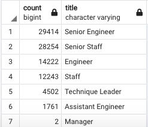
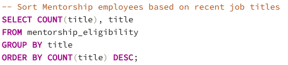
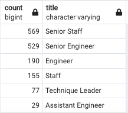
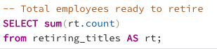
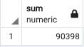

# Pewlett Hackard Analysis

## Overview of Project
The following project will look to an analysis of employee data from Pewlett Hackard, a large company with numerous employees, a subset of which are nearing or ready for retirement. The analysis will help Pewlett Hackard look ahead to best prepare as employees retire and leave the company, the eventuality dubbed as the “silver tsunami”.

### Purpose
Making use of SQL databases and queries, the resulting analysis of the employee data will identify which employees are eligible for retirement packages and which roles need replacements. Additionally, a portion of employees who are nearing retirement age will be eligible to participate in a Mentorship Program, allowing them to support Pewlett Hackard in the transition as employees retire. 

## Results
The queries used generated four additional resulting csv files as follows:
1.	retirement_titles
2.	unique_titles
3.	retiring_titles
4.	mentorship_eligibility

* Based on the retirement_titles.csv generated by the first query, there are over 100,000 employee records which match the retirement criteria – those born between 1952 and 1055.
* As employees would have experienced career changes throughout their time at Pewlett Hackard, there are duplicate entries based on employee numbers from the previous query. Making use of the DISTINCT ON statement and eliminating duplicate values, the number of employees fitting the retirement criteria is 90,398.
* The retiring_titles.csv sorts the number of employees eligible for retirement by title using the COUNT() function and GROUP BY statement, indicating that 29,414 are Senior Engineers, 28,254 are Senior Staff and so forth as shown below:

*retiring_titles*

* In order to determine those eligible to participate in the Mentorship Program, those within the age criteria were further filtered to include those born in 1965, identifying those within 10 years of retirement age who might be asked to assist Pewlett Hackard as they transition these tenured employees out and welcome in new employees.

## Summary
#### How many roles will need to be filled as the "silver tsunami" begins to make an impact?
As stated previously, a total of 90,398 employees fit the retirement criteria. It is more helpful to consider the impacts of their retirement when factoring their role at Pewlett Hackard. As per the retiring_titles.csv, this includes 29,414 Senior Engineers, 28,254 Senior Staff, 14,222 Engineers, 12,243 Staff, 4,502 Technique Leaders, 1,761 Assistant Engineers, and 2 Managers.

#### Are there enough qualified, retirement-ready employees in the departments to mentor the next generation of Pewlett Hackard employees?
Of the 90,398 employees eligible for retirement, 1,549 are eligible for the Mentorship Program. The qualifications for mentorship are unknown, but an assumption can be made that those in Senior roles may be better suited or prepared to mentor new hires or upcoming generations at Pewlett Hackard. To best determine if Pewlett Hackard is well positioned in this sense, it is best to conduct further analysis using additional queries.

One query would be to breakdown the 1,549 employees eligible for the Mentorship Program by title:

*Additional Query #1*

*Mentorship Program Employees by Title*

From the results above, there are 1,098 employees who have titles that include “Senior”, which is 71% of those eligible to be in the Mentorship Program. Since it appears that this titling is common place and does not necessarily indicate qualifications, we can then look to other title found, “Technique Leader”. Perhaps these 77 individuals would be equipped to provide mentorship as it can be assumed that they hold some type of expertise in their field as a leader. On assumptions alone, 77 individuals would not be a sufficient number of mentors to guide next generation employees. Despite this, it is important to note that the basis of qualifications to be a mentor for this Program are unknown.

Lastly, for convenience, an additional query can be created in order to provide the sum of all employees who are ready for retirement rather than to inspect the retiring_titles.csv:

*Additional Query #2*

*Total Retirement-Ready Employees*

As a result of this analysis, it would be beneficial for Pewlett Hackard to begin preparing for the retirement of a large subset of their workforce.

